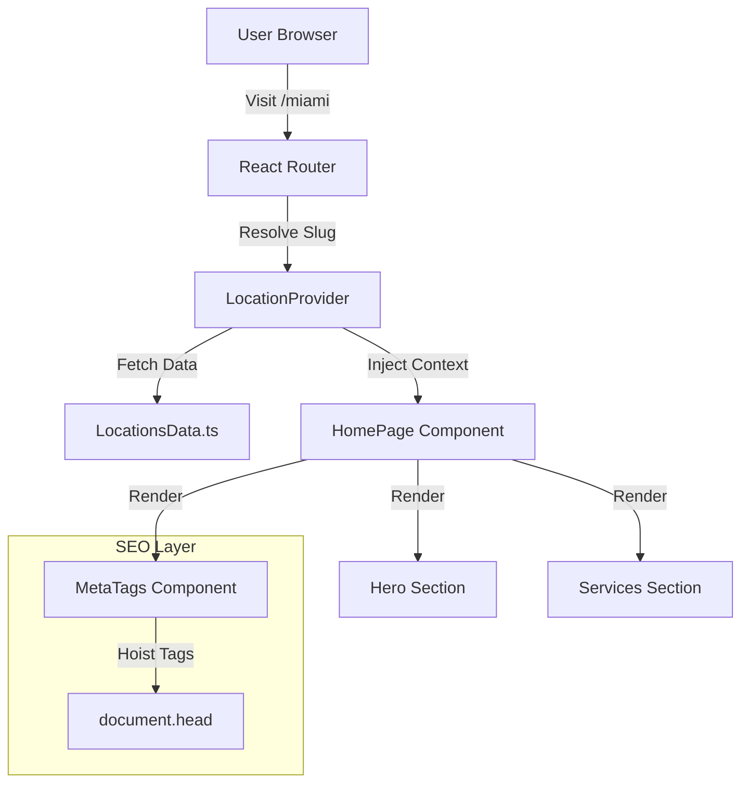

# TCS Junk Removal - Frontend

<div align="center">
  
  <br />
  <h3>A High-Performance, SEO-Optimized Booking Platform</h3>
  <p>
    <a href="https://tcs-junk-removal.vercel.app">View Live Demo</a> | 
    <a href="https://www.figma.com/design/fSIzRqJw8KjGYNEAlSAOut/TCS-Junk?m=auto&t=jGRrKdmpRkFbSYfX-6">View Figma Design</a> |
    <a href="https://github.com/NikitaaOvramenko/yourlocalservice-spingboot-backend">Backend Repository</a>
  </p>
</div>

---

## 🚀 Overview

TCS Junk Removal is a production-grade frontend application built to modernize the junk removal booking experience in Toronto and the GTA. Unlike typical "brochureware" sites, this application focuses on **conversion optimization**, **local SEO performance**, and **smooth, app-like interactivity**.

The project solves the business problem of capturing high-intent leads across multiple cities (Miami, Toronto, etc.) through a scalable architecture that treats each location as a distinct landing page without code duplication.

## ✨ Key Features

### 📍 Location-Aware & SEO Optimized

- **Dynamic Routing**: A single codebase serves multiple location pages (`/miami`, `/toronto`) with unique content and metadata.
- **Smart Meta Management**: Leverages **React 19's native metadata hoisting** to inject dynamic `<title>`, `<meta>`, and canonical tags for search engines.
- **Automated Sitemaps**: Custom TypeScript script generates a fresh `sitemap.xml` based on the location data model.

### ⚡ High-Performance UX

- **GSAP Animations**: Complex scroll-triggered animations (timelines, stagger effects) that guide user attention without layout thrashing.
- **Responsive & fluid**: Built with modern CSS (using `clamp()`, `min-h-dvh`) to ensure perfect rendering across all device sizes.
- **Optimized Assets**: Lazy loading and Vite-optimized bundling for sub-second load times.

## 🛠 Tech Stack & Rationale

| Technology          | Rationale                                                                                                                 |
| ------------------- | ------------------------------------------------------------------------------------------------------------------------- |
| **React 19**        | Chosen for latest concurrent features and native support for document metadata (eliminating the need for `react-helmet`). |
| **Vite**            | Provides instant HMR (Hot Module Replacement) and efficient production builds compared to CRA or Webpack.                 |
| **Tailwind CSS v4** | Utilizes the latest engine for instant compilation and zero-runtime CSS overhead.                                         |
| **GSAP**            | Selected over CSS transitions for complex, multi-stage timeline animations that require precise control.                  |
| **TypeScript**      | Enforces type safety across the location data models and component props, preventing runtime errors.                      |

## 🏗 Architecture

The application follows a **Domain-Driven Directory Structure**, grouping components by feature rather than type.



### Backend Integration

This frontend connects to a separate Spring Boot backend for handling form submissions, email notifications, and administrative tasks.

- **Backend Repo**: [yourlocalservice-springboot-backend](https://github.com/NikitaaOvramenko/yourlocalservice-spingboot-backend)

## 💻 Getting Started

### Prerequisites

- Node.js (v18+)
- npm or yarn

### Installation

1. **Clone the repository**

   ```bash
   git clone https://github.com/NikitaaOvramenko/TCS-Junk-Removal.git
   cd TCS-Junk-Removal-Frontend
   ```

2. **Install dependencies**

   ```bash
   npm install
   ```

3. **Set up Environment Variables**
   Create a `.env` file in the root:

   ```env
   VITE_DOMAIN=http://localhost:5173
   ```

4. **Run Development Server**

   ```bash
   npm run dev
   ```

5. **Generate Sitemap (Optional)**
   ```bash
   npm run generate-sitemap
   ```

## 🧠 Engineering Decisions & Tradeoffs

### SPA vs. SSR (Next.js/Remix)

**Decision**: Built as a Single Page Application (SPA) using Vite.

- **Tradeoff**: SPAs historically struggle with SEO compared to SSR.
- **Mitigation**: We utilized **React 19's Document Metadata** support and implemented a robust **sitemap generation script**. This ensures Google bots can crawl and index distinct location pages effectively without the operational complexity of managing a Node.js server.

### Canonical URLs

To prevent duplicate content penalties (e.g., accessing the same page via different query params), we implemented **self-referencing canonical tags** using a custom hook that cleans URL paths. This signals to search engines exactly which URL is the source of truth.

## 🔮 Future Improvements

- [ ] **Unit Testing**: Add Vitest + React Testing Library for critical booking flows.
- [ ] **E2E Testing**: Integrate Playwright to verify cross-browser rendering.
- [ ] **SSR Migration**: Evaluate migration to Remix if SEO requirements become more aggressive (e.g., social media preview cards which require server-rendered HTML).

---

<div align="center">
  <sub>Built by Nikita Ovramenko</sub>
</div>
